

# DEYE / Analys

**Monitoring, analysis and technical service for hybrid inverters**

From live data to service reports, in one workspace.

[Türkçe](README.md) · **English**

[Live charts](#live-charts) · [Parameters](#parameter-management) · [Tests](#function-tests) · [Reporting](#session-history-and-reports)

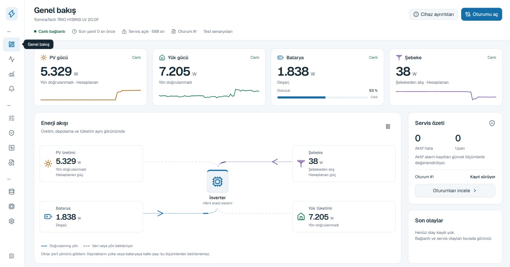

DEYE / Analys brings PV generation, battery status, grid exchange and load consumption into one view. It connects **device monitoring, parameter review, function testing and service reporting** for technical service teams and test engineers.

**Live monitoring** &nbsp; · &nbsp; **Controlled settings** &nbsp; · &nbsp; **Service tests** &nbsp; · &nbsp; **Session reports**

---

## Energy flow and overview

Track energy movement between PV, battery, grid and loads through power cards and a flow view. Battery state of charge, connection status, active alarms and service summaries share the same workspace.

Open another operating view

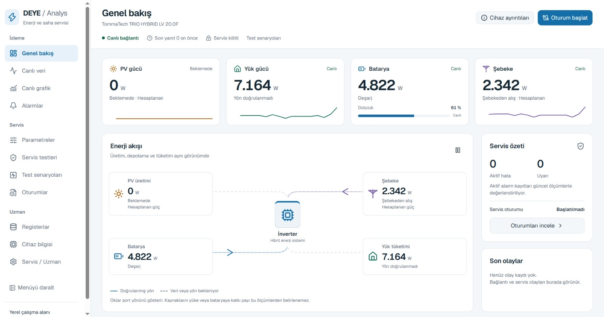

## Live charts

Compare power changes on a shared timeline. Explore PV/DC, battery, grid/AC, load, generator and temperature profiles with time-range selection, pause and automatic scaling.

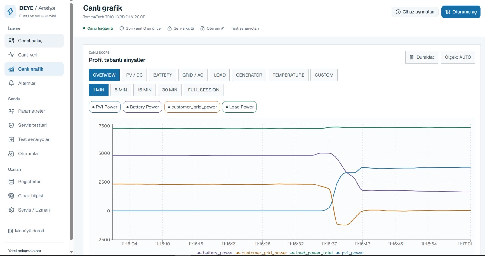

## Phase and temperature measurements

Review L1, L2 and L3 voltages, per-phase load power and battery/DC/AC temperatures together. See phase distribution and thermal operating conditions alongside total power.

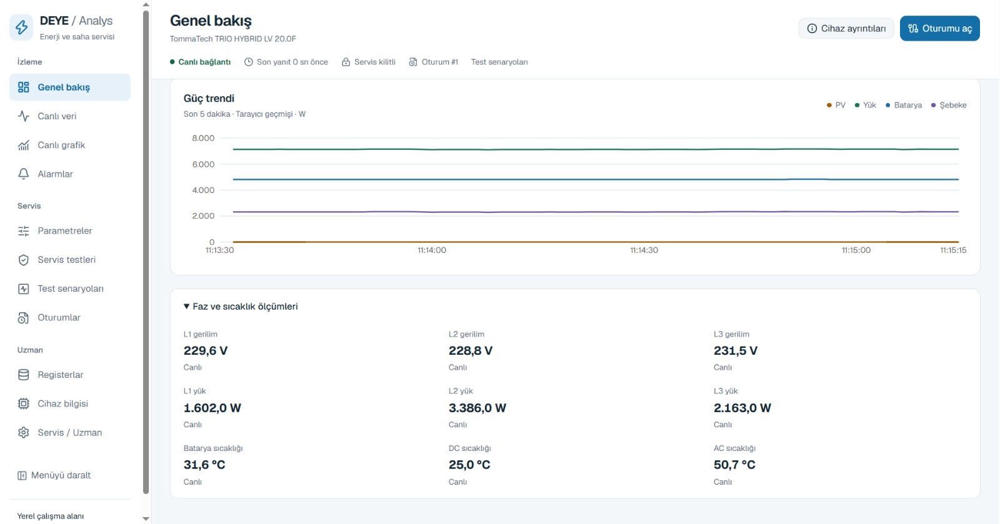

## Alarms and event history

Track active faults and warnings alongside persistent event records. Power, temperature, BMS and relay data captured at fault time help place issues in their operating context.

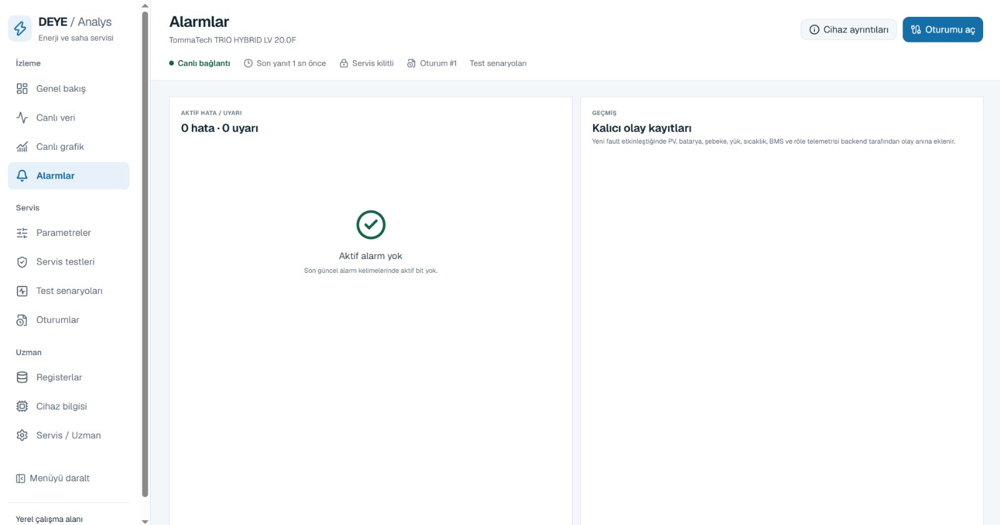

## Parameter management

Manage settings such as battery capacity, charge/discharge currents and SOC thresholds according to the device profile. Compare proposed changes before applying them, then check confirmation and readback.

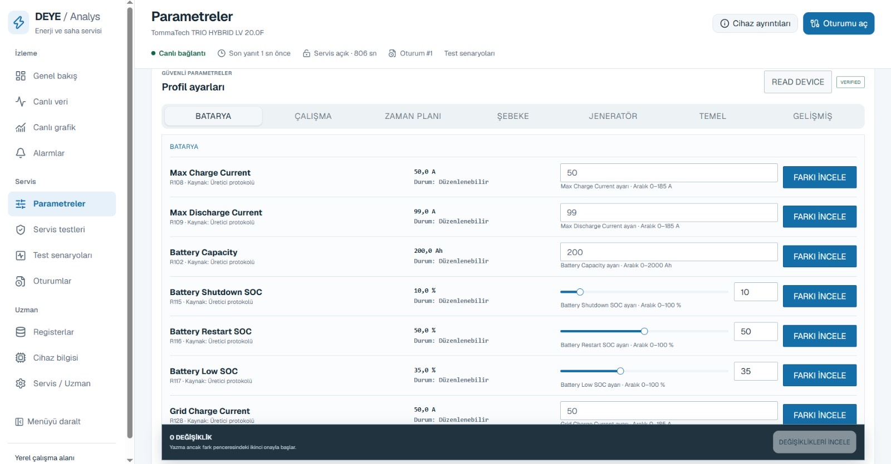

Service lock and read-only view

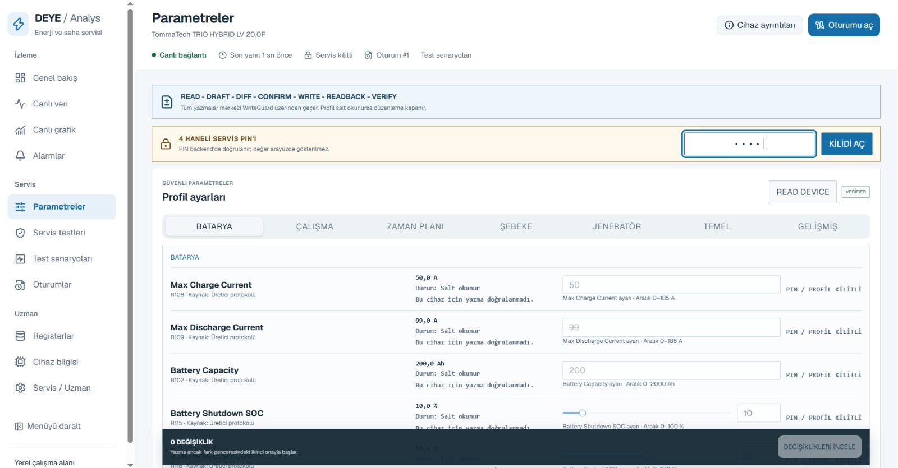

## Charging schedule

Set start time, power, target SOC and charging source across six periods. Adapt the charging plan to operating needs with grid and generator options.

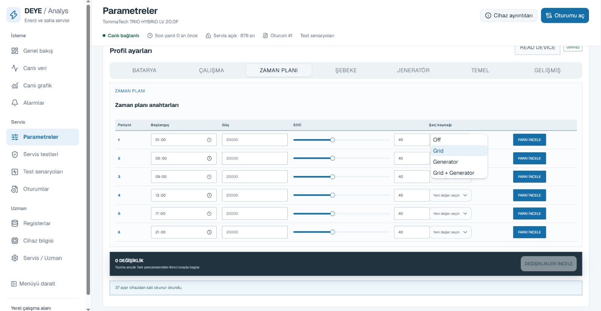

## Service tests

Review fan, generator relay and display/LED/buzzer tests alongside lithium interface, LCD key and relay monitoring cards. Each card displays its device verification status; the example shows a verified fan test.

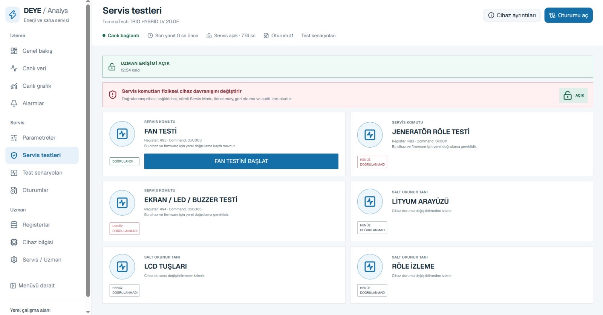

## Function tests

Follow scenarios for PV generation, battery charging, load supply, grid export, zero export, phase balance and fault-free operation. Separate preconditions and results make successful, not-run and unmet-condition states easy to distinguish.

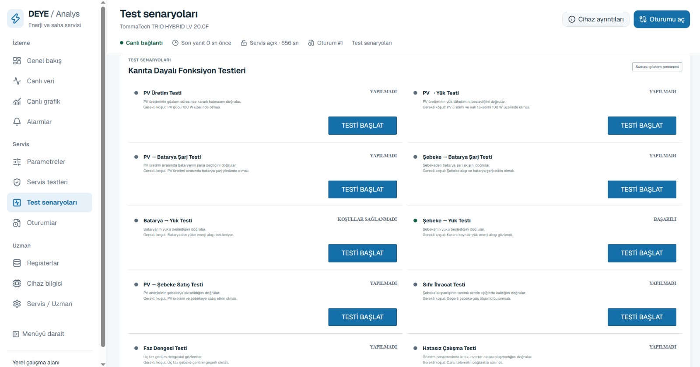

View test precondition tracking

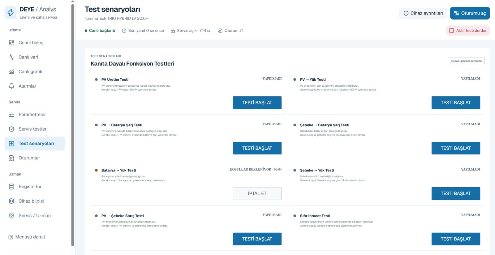

## Service sessions and manual measurements

Collect technician and device details, bench measurements and notes in one service record. Track session duration, sample count, faults and test summaries throughout the session.

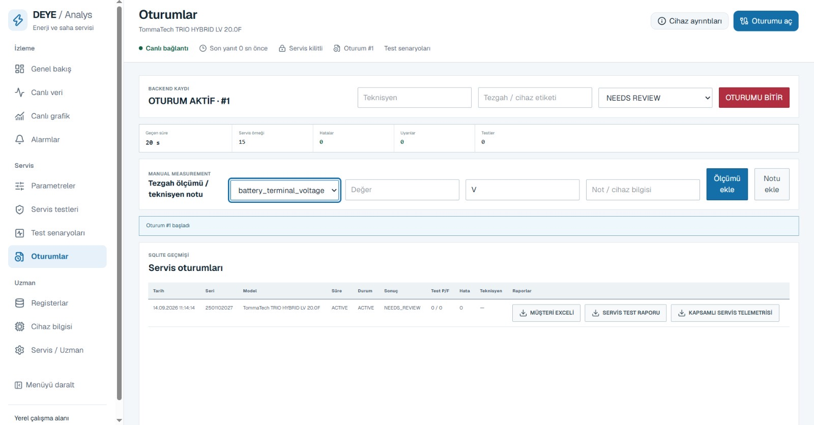

## Session history and reports

Review completed sessions and their outcomes. Customer Excel, service test report and comprehensive service telemetry exports turn technical work into shareable records.

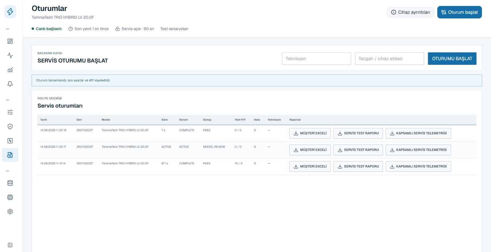

---

### Who is it for?

**Technical service teams** investigating faults and documenting work; **test engineers** checking measurements and functions; **field teams** assessing device behavior and settings.

Device shown: TommaTech TRIO HYBRID LV 20.0F. Available settings and tests depend on model, firmware and profile verification. Screenshots show the original Turkish interface.

**Deniz Türker Tuncer** · Mechatronics Engineer  
[Developer profile](https://github.com/deniztuncerz) · [Türkçe tanıtım](README.md)

